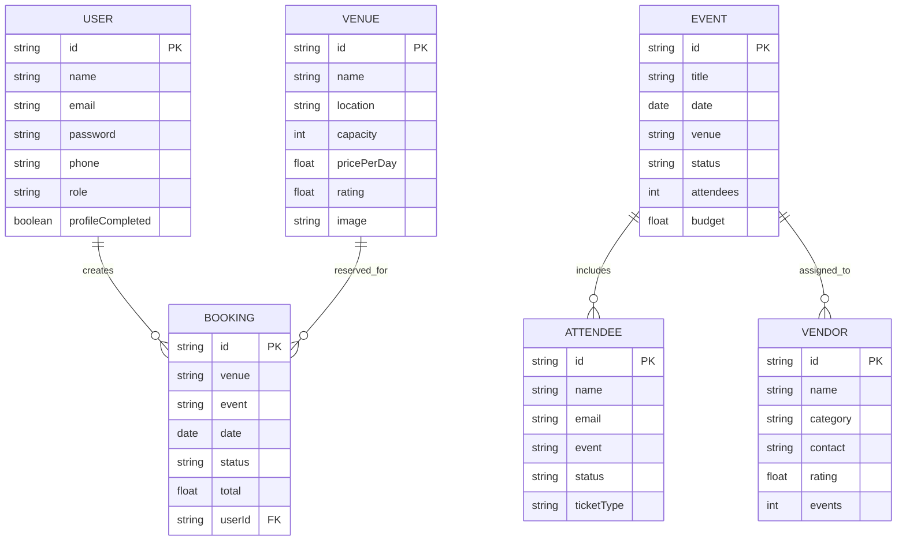

# 05 — ER Diagram

```mermaid
erDiagram
    USER ||--o{ BOOKING : creates
    VENUE ||--o{ BOOKING : reserved_for
    EVENT ||--o{ ATTENDEE : includes
    EVENT ||--o{ VENDOR : assigned_to

    USER {
      string id PK
      string name
      string email
      string password
      string phone
      string role
      boolean profileCompleted
    }

    EVENT {
      string id PK
      string title
      date date
      string venue
      string status
      int attendees
      float budget
    }

    VENUE {
      string id PK
      string name
      string location
      int capacity
      float pricePerDay
      float rating
      string image
    }

    ATTENDEE {
      string id PK
      string name
      string email
      string event
      string status
      string ticketType
    }

    VENDOR {
      string id PK
      string name
      string category
      string contact
      float rating
      int events
    }

    BOOKING {
      string id PK
      string venue
      string event
      date date
      string status
      float total
      string userId FK
    }
```
