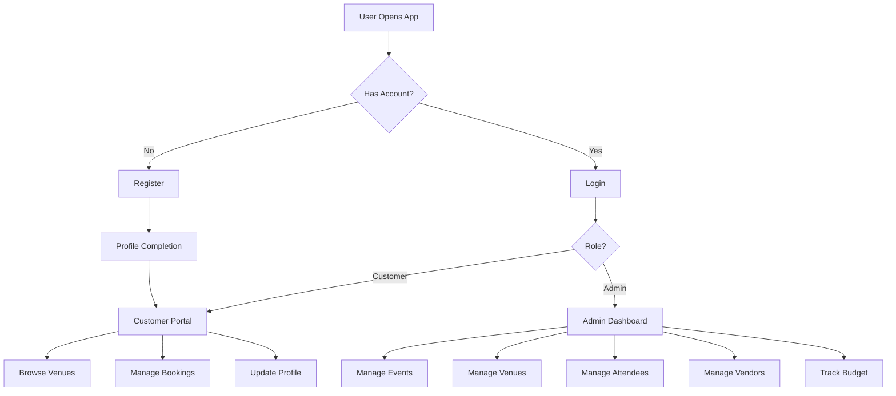

# 07 — User Flow Document

```mermaid
flowchart TD
    A[User Opens App] --> B{Has Account?}
    B -- No --> C[Register]
    C --> D[Profile Completion]
    D --> E[Customer Portal]
    B -- Yes --> F[Login]
    F --> G{Role?}
    G -- Admin --> H[Admin Dashboard]
    H --> H1[Manage Events]
    H --> H2[Manage Venues]
    H --> H3[Manage Attendees]
    H --> H4[Manage Vendors]
    H --> H5[Track Budget]
    G -- Customer --> E
    E --> E1[Browse Venues]
    E --> E2[Manage Bookings]
    E --> E3[Update Profile]
```
